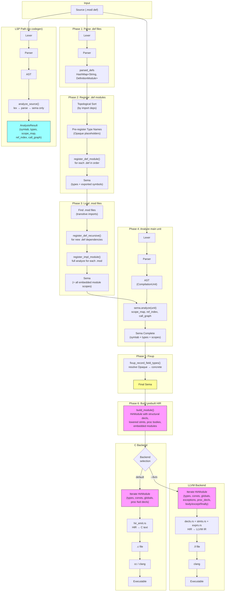

# Compilation Pipeline



## Key Points

- **Single sema, shared by both backends.** Sema runs once; both C and LLVM backends read the same symtab, types, and scope chain.
- **Prebuilt HirModule is the primary data source.** `build_module()` constructs an `HirModule` after sema, containing structural declarations (types, consts, globals, proc signatures, embedded modules) and pre-lowered statement bodies. Both backends iterate from HirModule for structural emission.
- **HIR is the single codegen path for all statement/expression bodies.** Statement and expression lowering resolves designators, expands open array arguments, desugars WITH, and registers TYPECASE bindings. No AST walking remains in body codegen for either backend.
- **TypeId → C name resolver.** A `typeid_c_names` map resolves TypeIds to C typedef names, populated incrementally from HirModule type_decls, def-module registration, and gen_type_decl emission. Only non-structural types (records, enums, arrays, aliases) are registered to avoid cross-module pointer-type name conflicts.
- **Both backends are fully HIR-driven.** Neither backend walks the AST for codegen. The C backend uses `type_id_to_c()` and `field_type_and_suffix()` for TypeId-based type resolution. The LLVM backend uses `tl_type_str()` from type_lowering and `llvm_type_for_type_id()` — both resolve from TypeIds, not AST TypeNodes.
- **Phase 3 uses full analysis** (`register_impl_module` → `analyze_implementation_module`) so that procedure parameters, local variables, and constants in embedded modules are all registered in sema's scope chain. The HIR builder depends on this.
- **Def modules are topologically sorted** (Phase 2) and recursively registered (Phase 3) so that cross-module type references (e.g., `URIRec` from `URI.def` used by `HTTPClient.def`) resolve in the correct order.
- **M2+ exception handling** uses setjmp/longjmp-based `m2_ExcFrame` stack in both backends. The C backend emits `M2_TRY`/`M2_CATCH` macros; the LLVM backend calls `m2_exc_push`/`setjmp`/`m2_exc_pop` runtime functions directly.
- **LSP skips codegen entirely.** The analysis-only path (`analyze_source`) produces the same sema artifacts without generating C or LLVM IR.

## Module Structure

```
src/
  driver.rs              Pipeline orchestration (Phases 1-5, backend dispatch)
  lexer.rs               Tokenizer
  parser.rs              Recursive-descent → AST
  ast.rs                 AST node types
  sema.rs                Semantic analysis (type checking, scope resolution)
  symtab.rs              Symbol table (scoped, nested)
  types.rs               Type registry
  hir.rs                 HIR types (Place, HirExpr, HirStmt, HirModule, HirProcDecl, etc.)
  hir_build.rs           build_module() + HirBuilder (designator resolution, call expansion)
  analyze.rs             LSP analysis-only path
  build.rs               mx build/run/test subcommands
  codegen_c/
    mod.rs               C backend core
    modules.rs           Module-level codegen, embedded impl modules
    decls.rs             Procedure/variable declarations
    stmts.rs             Statement dispatch (routes all to HIR)
    hir_emit.rs          HIR → C emission (all statements + expressions)
    exprs.rs             Legacy helpers (escape functions)
    designators.rs       HIR Place → C designator strings
    types.rs             Type → C type string mapping
    m2plus.rs            M2+ type/declaration codegen (REF, OBJECT, EXCEPTION)
  codegen_llvm/
    mod.rs               LLVM backend core (registration APIs, generate entry)
    modules.rs           Module-level codegen (all HIR-driven, zero AST deps)
    decls.rs             HIR-based type/const/var/proc emission
    stmts.rs             HIR → LLVM IR statements (PIM4 + M2+ exceptions)
    exprs.rs             HIR → LLVM IR expressions, short-circuit, COMPLEX builtins
    designators.rs       HIR Place → LLVM IR address/load (variant field offsets)
    types.rs             TypeId resolution, type coercion
    type_lowering.rs     M2 types → LLVM IR types
    llvm_types.rs        LLVM type representation
    stdlib_sigs.rs       Standard library call signatures
    debug_info.rs        DWARF metadata
    closures.rs          (removed — captures now in HirProcDecl.closure_captures)
```
