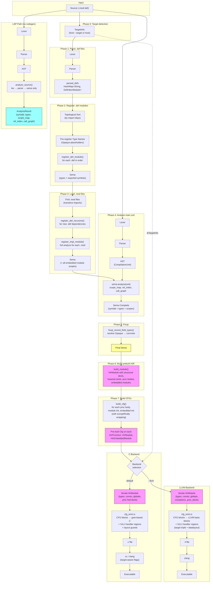

# Compilation Pipeline



## Key Points

- **Target-first.** `TargetInfo` is constructed before any compilation — from `--target` or host detection. Both backends receive `&TargetInfo` and use it for target-specific output (LLVM triple/datalayout, C layout guards, linker flags).
- **Single sema, shared by both backends.** Sema runs once; both C and LLVM backends read the same symtab, types, and scope chain.
- **Prebuilt HirModule is the primary data source.** `build_module()` constructs an `HirModule` after sema, containing structural declarations (types, consts, globals, proc signatures, embedded modules) and pre-lowered statement bodies. Both backends iterate from HirModule for structural emission.
- **CFG is the single source of truth for control flow.** After HIR construction, all procedure and init bodies are lowered to CFGs (`build_cfg`). Both backends iterate CFG blocks in order, emitting labels, statements, and terminators. No backend reconstructs structured control flow from HIR — IF/WHILE/CASE/LOOP/FOR/TRY are all represented as CFG Goto/Branch/Switch/Return/Raise terminators.
- **HIR provides expressions and simple statements.** CFG blocks contain `HirStmt` (only Assign and ProcCall). Expression emission uses HIR's `HirExpr` tree. Designator resolution, open array expansion, WITH desugaring, and TYPECASE bindings are all handled by the HIR builder before CFG construction.
- **TypeId → C name resolver.** A `typeid_c_names` map resolves TypeIds to C typedef names, populated incrementally from HirModule type_decls, def-module registration, and gen_type_decl emission. Only non-structural types (records, enums, arrays, aliases) are registered to avoid cross-module pointer-type name conflicts.
- **Phase 3 uses full analysis** (`register_impl_module` → `analyze_implementation_module`) so that procedure parameters, local variables, and constants in embedded modules are all registered in sema's scope chain. The HIR builder depends on this.
- **Def modules are topologically sorted** (Phase 2) and recursively registered (Phase 3) so that cross-module type references (e.g., `URIRec` from `URI.def` used by `HTTPClient.def`) resolve in the correct order.
- **M2+ exception handling** uses setjmp/longjmp-based `m2_ExcFrame` stack. The CFG annotates blocks with `handler: Option<BlockId>` for exception regions. Both backends detect handler transitions during block emission and emit SJLJ frame setup/teardown inline. Proc-level EXCEPT and module-level FINALLY are folded into the CFG via synthetic TRY wrapping in the driver.
- **LSP skips codegen entirely.** The analysis-only path (`analyze_source`) produces the same sema artifacts without generating C or LLVM IR.

## Module Structure

```
src/
  target.rs              Target abstraction (TargetInfo, layout computation, ABI)
  driver.rs              Pipeline orchestration (Phases 1-5, backend dispatch)
  lexer.rs               Tokenizer
  parser.rs              Recursive-descent → AST
  ast.rs                 AST node types
  sema.rs                Semantic analysis (type checking, scope resolution)
  symtab.rs              Symbol table (scoped, nested)
  types.rs               Type registry
  hir.rs                 HIR types (Place, HirExpr, HirStmt, HirModule, HirProcDecl, etc.)
  hir_build/
    mod.rs               build_module(), struct defs, helpers, tests
    lower.rs             HirBuilder impl (designator resolution, expr/stmt lowering, call expansion)
  cfg/
    mod.rs               Data model (BasicBlock, Terminator, Cfg), verify, cleanup, DOT output
    build.rs             CfgBuilder, build_cfg(), all control-flow lowering
  analyze.rs             LSP analysis-only path
  build.rs               mx build/run/test subcommands
  codegen_c/
    mod.rs               C backend core
    cfg_emit.rs          CFG-driven body emission (block labels, goto terminators, SJLJ handlers)
    modules.rs           Module-level codegen, embedded impl modules
    decls.rs             Procedure/variable declarations
    stmts.rs             Statement dispatch (routes Assign/ProcCall to HIR emitter)
    hir_emit.rs          HIR → C emission for Assign/ProcCall statements and expressions
    exprs.rs             Legacy helpers (escape functions)
    designators.rs       HIR Place → C designator strings
    types.rs             Type → C type string mapping
    m2plus.rs            M2+ type/declaration codegen (REF, OBJECT, EXCEPTION)
  codegen_llvm/
    mod.rs               LLVM backend core (registration APIs, generate entry)
    cfg_emit.rs          CFG-driven body emission (LLVM basic blocks, br terminators, SJLJ handlers)
    modules.rs           Module-level codegen (all HIR-driven, zero AST deps)
    decls.rs             HIR-based type/const/var/proc emission
    stmts.rs             HIR → LLVM IR statements (Assign/ProcCall only)
    exprs.rs             HIR → LLVM IR expressions, COMPLEX builtins
    designators.rs       HIR Place → LLVM IR address/load (variant field offsets)
    types.rs             TypeId resolution, type coercion
    type_lowering.rs     M2 types → LLVM IR types
    llvm_types.rs        LLVM type representation
    stdlib_sigs.rs       Standard library call signatures
    debug_info.rs        DWARF metadata
```
