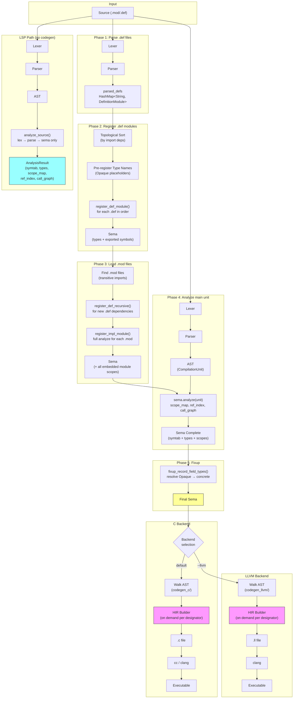

# Compilation Pipeline



## Key Points

- **Single sema, shared by both backends.** Sema runs once; both C and LLVM backends read the same symtab, types, and scope chain.
- **HIR is on-demand, not a separate pass.** Each backend constructs an `HirBuilder` per designator during codegen. The builder uses sema's scope chain to resolve variables, apply field/index/deref projections, and expand open array arguments.
- **Phase 3 uses full analysis** (`register_impl_module` → `analyze_implementation_module`) so that procedure parameters, local variables, and constants in embedded modules are all registered in sema's scope chain. The HIR builder depends on this.
- **Def modules are topologically sorted** (Phase 2) and recursively registered (Phase 3) so that cross-module type references (e.g., `URIRec` from `URI.def` used by `HTTPClient.def`) resolve in the correct order.
- **LSP skips codegen entirely.** The analysis-only path (`analyze_source`) produces the same sema artifacts without generating C or LLVM IR.

## Module Structure

```
src/
  driver.rs              Pipeline orchestration (Phases 1-5, backend dispatch)
  lexer.rs               Tokenizer
  parser.rs              Recursive-descent → AST
  ast.rs                 AST node types
  sema.rs                Semantic analysis (type checking, scope resolution)
  symtab.rs              Symbol table (scoped, nested)
  types.rs               Type registry
  hir.rs                 HIR types (Place, Projection, HirExpr, HirStmt)
  hir_build.rs           HIR builder (designator resolution, call arg expansion)
  analyze.rs             LSP analysis-only path
  build.rs               mx build/run/test subcommands
  codegen_c/
    mod.rs               C backend core
    modules.rs           Module-level codegen, embedded impl modules
    decls.rs             Procedure/variable declarations
    stmts.rs             Statement generation
    exprs.rs             Expression generation, builtin calls
    designators.rs       HIR → C designator emission
    types.rs             Type → C type string mapping
    m2plus.rs            M2+ extensions (TRY/EXCEPT, REF, OBJECT)
  codegen_llvm/
    mod.rs               LLVM backend core
    modules.rs           Module-level codegen, preamble
    decls.rs             Procedure declarations, debug info
    stmts.rs             Statement generation
    exprs.rs             Expression generation, function calls
    designators.rs       HIR → LLVM IR designator emission
    types.rs             Type resolution
    type_lowering.rs     M2 types → LLVM IR types
    llvm_types.rs        LLVM type representation
    stdlib_sigs.rs       Standard library call signatures
    debug_info.rs        DWARF metadata
    closures.rs          Nested procedure closure capture
```
